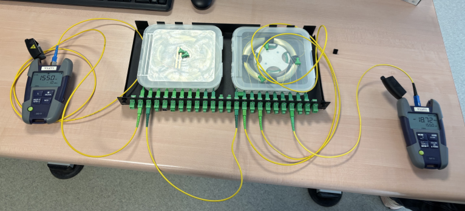

# SAE13 : Compte Rendu de Mesures sur Fibre Optique

**Noms :** 

**Liaison étudiée :** L5  
**Date :** 13/01/2026

---

## 1. Objectif du projet
L'objectif de cette manipulation est de **qualifier une liaison fibre optique** de type FTTH (Fiber To The Home) en mesurant son atténuation globale par la méthode de **photométrie**. Il s'agit de reproduire le brassage d'un boîtier GPON et de valider la qualité de la transmission lumineuse à une longueur d'onde de 1550 nm.

## 2. Matériel et Configuration
Pour réaliser ces mesures, nous avons utilisé le matériel suivant :
* **Source Laser (Émetteur) :** VIAVI (réglée sur $\lambda = 1550$ nm).
* **Photomètre (Récepteur) :** VIAVI OLP-35.
* **Dispositif de test :** Boîtier de brassage fibre optique simulant un réseau local.
* **Connectique :** Jarretières optiques monomodes.

## 3. Protocole de mesure
La procédure s'est déroulée en deux étapes principales :

1.  **Mesure de référence ($P_{ref}$) :** Nous avons d'abord relié directement la source au photomètre avec une jarretière courte pour calibrer le "zéro" et mesurer la puissance émise en sortie de source.

2.  **Mesure de la liaison ($P_{mes}$) :** Nous avons ensuite réalisé le câblage de la liaison imposée (voir tableau des affectations) en connectant les différents points de brassage sur le panneau noir.

### Illustration du montage réalisé
Ci-dessous, la photo du dispositif câblé et de la mesure finale affichée sur l'appareil.

## 4. Résultats et Analyse

### Relevé des valeurs
Les mesures ont été effectuées à la longueur d'onde de **1550 nm**.

* **Puissance de référence ($P_{ref}$) :** **-13.8 dBm** *
    *(Valeur mesurée lors de la calibration, à récupérer dans vos notes).*
* **Puissance mesurée en fin de liaison ($P_{mes}$) :** **-18.72 dBm** *(Valeur relevée sur la photo du montage).*

### Calcul de l'atténuation globale ($A$)
L'atténuation représente la perte de puissance du signal à travers la liaison (fibre + connecteurs + épissures). Elle se calcule par la différence entre la puissance émise et la puissance reçue.

$$A = P_{ref} - P_{mes}$$

$$A = -13.8 - (-18.72)$$

alors :  
$A = -13.8 - (-18.72) = 4.92 \text{ dB}$.

## 5. Conclusion
L'atténuation mesurée de **4.92 dB** permet de caractériser la liaison.
* Si l'atténuation est cohérente avec le nombre de connexions (environ 0.5 dB par connexion + atténuation linéique de la fibre), la liaison est valide.
* Une atténuation trop forte pourrait indiquer une contrainte excessive sur une fibre (courbure), un connecteur sale ou un mauvais câblage.